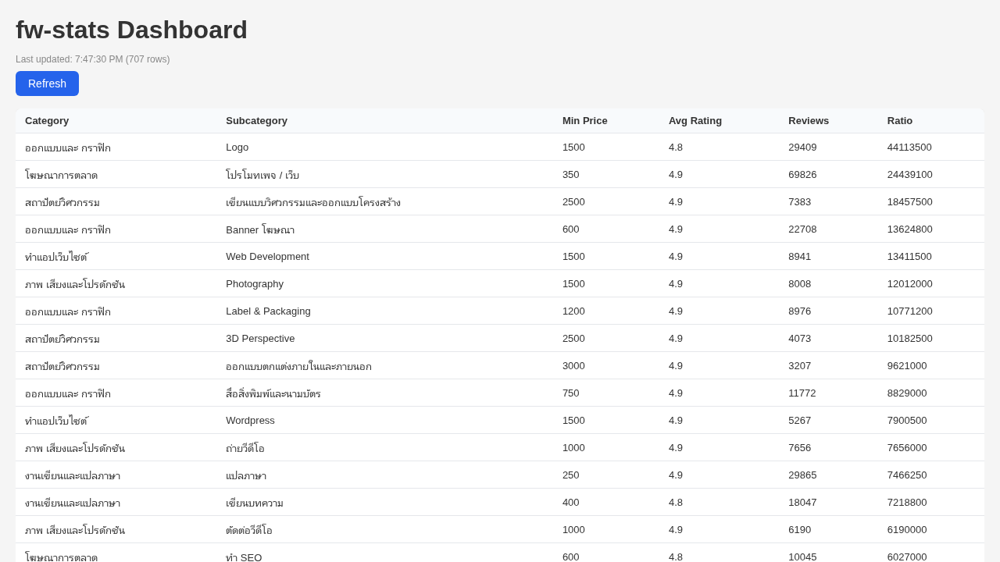

# fw-stats

CLI tool + web dashboard for FastWork marketplace stats.

Reads **public** category/subcategory data (minimum prices, average ratings, review counts) from FastWork's public GraphQL endpoint. No login required. No private data accessed.

## Screenshots

### CLI
```
Category               Subcategory                         Min Price  Avg Rtg  Reviews  Ratio
────────────────────────────────────────────────────────────────────────────────────────────────
ออกแบบและ กราฟิก       Logo                                1500       4.8      29409    44113500
โฆษณาการตลาด           โปรโมทเพจ / เว็บ                    350        4.9      69826    24439100
สถาปัตย์วิศวกรรม       เขียนแบบวิศวกรรมและออกแบบโครงสร้าง  2500       4.9      7383     18457500
ออกแบบและ กราฟิก       Banner โฆษณา                        600        4.9      22708    13624800
ทำแอปเว็บไซต์          Web Development                     1500       4.9      8941     13411500
ภาพ เสียงและโปรดักชัน  Photography                         1500       4.9      8008     12012000
ออกแบบและ กราฟิก       Label & Packaging                   1200       4.9      8976     10771200
สถาปัตย์วิศวกรรม       3D Perspective                      2500       4.9      4073     10182500
สถาปัตย์วิศวกรรม       ออกแบบตกแต่งภายในและภายนอก          3000       4.9      3207     9621000
ออกแบบและ กราฟิก       สื่อสิ่งพิมพ์และนามบัตร             750        4.9      11772    8829000
```

### Web Dashboard



## Install

```bash
npm install -g fw-stats
```

## Usage

```bash
fw-stats [options]

Commands:
  serve          Start local dashboard server on port 3456

Options:
  --sort <field>   Sort by: price | ratio (default) | reviews
  --top <N>        Show only top N results (default: 20)
  --all            Show all results (no limit)
  --json           Output JSON array
  --csv            Output CSV with headers
  --tsv            Output TSV (tab-separated)
  -h, --help       Show this help
```

### Examples

```bash
# Top 20 subcategories by opportunity score (price × reviews)
fw-stats

# Top 10 highest-priced subcategories as JSON
fw-stats --sort price --top 10 --json

# Full data as CSV
fw-stats --all --csv > fw-stats.csv

# Launch web dashboard
fw-stats serve
```

## Dashboard

`fw-stats serve` starts a local web dashboard at `http://localhost:3456` with:
- Sortable table of all categories/subcategories
- Bar chart: Top 15 subcategories by review count
- Bar chart: Subcategories per category
- Refresh button to fetch latest data

## Data

This tool fetches **public marketplace listing data**:
- Category / subcategory names
- Minimum price per subcategory
- Average rating
- Review count

No user account data, no private information, no personal data is ever accessed.

## Disclaimer

This tool reads only publicly available data. Use responsibly.
FastWork may rate-limit or block the endpoint at any time.
This project has no affiliation with Fastwork.

## License

MIT
